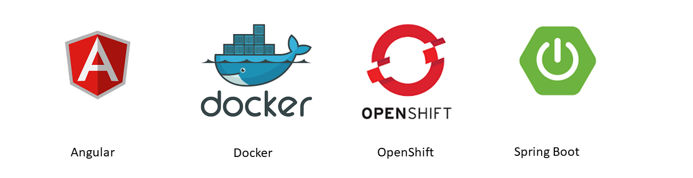

# Cloud-ready Mobile Banking with Virtualized Services based on Servlet

## Technology Stack
This projects illustrates the usages fo the following technologies:

## Full Service Virtualization
This application provides the service virtualization to test the mobile web banking PoC projects:
[mobileweb-angular-mvc-poc](https://github.com/dhui808/mobileweb-angular-mvc-poc)
and [mobileweb-angular-redux-poc](https://github.com/dhui808/mobileweb-angular-redux-poc).

The design of of this tool is completely different from any of the Service Virtualization tools
currently available in the market. It allows the user to test multiple scenarios for the same
transaction without the need for the user to configure the services or use any specific input data.
The user simply selects the scenario he or she wants to test first, 

This application provides the service virtualization to test the mobile web banking PoC projects: mobileweb-angular-mvc-poc and mobileweb-angular-redux-poc.

The design of of this tool is completely different from any of the Service Virtualization tools currently available in the market. It allows the user to 
test multiple scenarios for the same transaction without the need for the user to configure the services or use any specific input data. The user simply 
selects the scenario he or she wants to test first, then proceed to test it. It greatly increases the developer productivity and is invaluable for quality 
assurance.

## Dependency

This project depends on my two other projects:

[service virtualization UI application](https://github.com/dhui808/service-virtualization-ui)

[service virtualization data](https://github.com/dhui808/service-virtualization-data)

## Application Configuration
There are two configuration files: application.properties and logback-spring.xml, under resources folder.

The application.properties looks like below:

webservicemockdata.home=/usr/github/webservicemockdata server.servlet.context-path=/banking logging.config=file:/usr/springbootlogging/logback-spring.xml

The logback-spring.xml must be copied to the location as specified by logging.config property in application.properties.

The content of project webservicemockdata must be copied to the location as specified by webservicemockdata.home property in application.properties.

## Build
cd webservicemockserver
mvn clean package

## Run locally
./start.sh

## Run locally with Spring Boot
./mvnw clean spring-boot:run

## Run Docker image
docker run -d -p 8080:8080 -p 5005:5005 -t yourdockerid/webservicemockserver

## Stop and kill Docker container
docker ps\
(Look for the container ID)

dcoker stop <container_id>\
docker rm <container_id>

## Deploy to OpenShift
Log in to your OpenShift account with the proper server url, username and passowrd:\
oc login --insecure-skip-tls-verify --server=https://master.na311.openshift.opentlc.com:443 

Create OpenShift project myproject\
oc new-project myproject

Create an application from Docker image docker.io/yourdockerid/webservicemockserver\
oc new-app docker.io/yourdockerid/webservicemockserver --name webservicemockserver

Expose your server at port 8080\
oc expose dc/webservicemockserver --port=8080

Create a route:\
oc expose service/webservicemockserver

Import Docker image:\
oc import-image webservicemockserver

Create ConfigMap for the Spring logging configuration file:\
oc create configmap springbootlogconfig --from-file=/usr/springbootlogging/logback-spring.xml

oc get pods -w -n lab3-product-catalog-dc

oc get route webservicemockserver

From the route from the above command, point your browser at the corresponding URL. A sample browser URL should look like below:

http://webservicemockserver-lab3-product-catalog-dc.apps.na311.openshift.opentlc.com/banking/
 